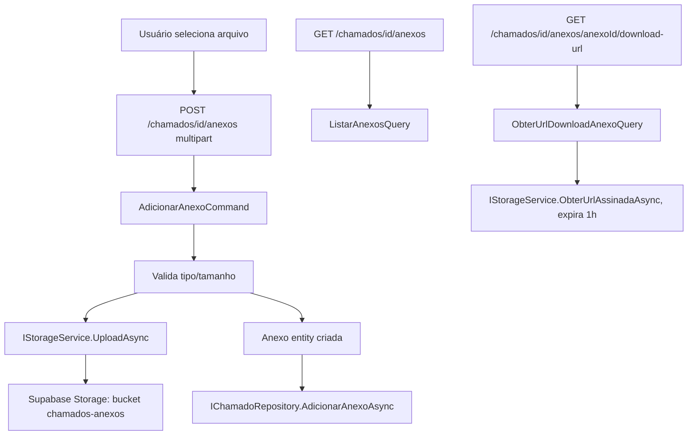

# Anexos (Supabase Storage) — Design

**Spec**: `.specs/features/anexos-storage/spec.md`
**Status**: Draft

---

## Pesquisa (Knowledge Verification Chain)

SDK oficial: pacote NuGet **`Supabase`** (antigo `supabase-csharp`, renomeado — mesmo pacote). Confirmado via Context7 + busca web (docs oficiais `supabase.com/docs/reference/csharp`):

- Inicialização: `new Supabase.Client(url, key, options)` seguido de `await client.InitializeAsync()`
- Acesso ao Storage: `client.Storage.From("bucket_name")` retorna `StorageFileApi`
- Upload: `Task<string> Upload(byte[] data, string supabasePath, FileOptions? options = null, ...)`
- URL assinada: `Task<string> CreateSignedUrl(string path, int expiresIn, ...)`
- Download (não usado neste design — ver decisão abaixo): `Task<byte[]> Download(string supabasePath, ...)`
- Server-side, usar o **service_role key** (não o anon/public key) — chave privada, nunca exposta ao cliente

Fontes: [C# API Reference](https://supabase.com/docs/reference/csharp/introduction), [Upload a file](https://supabase.com/docs/reference/csharp/storage-from-upload), [StorageFileApi class](https://supabase-community.github.io/supabase-csharp/api/Supabase.Storage.StorageFileApi.html), [Server-Side Applications wiki](https://github.com/supabase-community/supabase-csharp/wiki/Server-Side-Applications).

---

## Architecture Overview

Mesmo padrão CQRS/MediatR das outras features de `Chamados` (Comentários é o sibling mais próximo — sub-recurso de um chamado, mesma pasta `Features/Chamados/`). `IStorageService` (já existe como esqueleto da Fase 1) ganha implementação real via SDK oficial do Supabase.



---

## Code Reuse Analysis

| Componente existente | Local | Como reaproveitar |
|---|---|---|
| `Anexo` (entidade) | `Domain/Entities/Anexo.cs` | Já existe, ganha 2 campos novos (ver Data Models) |
| `IStorageService` | `Domain/Interfaces/IStorageService.cs` | Assinatura revisada (ver Tech Decisions) |
| `AnexoConfiguration` | `Infrastructure/Data/Configurations/` | Já mapeia `Anexo` — só adiciona os 2 campos novos |
| Padrão de sub-recurso de Comentários (`ComentarChamadoCommand`/`ListarComentariosQuery`) | `Features/Chamados/` | Mesma estrutura de pastas e nomenclatura pros Anexos |
| `ICurrentUserService` | `Application/Common/` | Identidade de quem enviou vem do token — **não** repete o gap antigo de `Comentar` (que ainda recebe `Autor` client-supplied) |
| `AuthSettings` + registro em `Program.cs` | `Application/Common/AuthSettings.cs` | Modelo pra `SupabaseSettings` (nova) |

---

## Data Models

### `Anexo` (Domain — 2 campos novos)

```csharp
public Guid? EnviadoPorId { get; private set; }
public string EnviadoPorNome { get; private set; } = string.Empty;
```

Preenchidos a partir de `ICurrentUserService` no Controller (mesmo padrão do resto do app pós-T09/F5b), não client-supplied. Precisa de migration aditiva (2 colunas nullable/com default), mesmo processo já usado em `AddNumeroChamado`.

### `SupabaseSettings` (Application, novo)

```csharp
public class SupabaseSettings
{
    public string Url { get; set; } = string.Empty;
    public string ServiceRoleKey { get; set; } = string.Empty;
    public string Bucket { get; set; } = "chamados-anexos";
}
```

Configurado via `user-secrets` (`Supabase:Url`, `Supabase:ServiceRoleKey`) — mesmo padrão de `Auth:GoogleClientId`. `Url` é derivável da connection string já existente (`postgres.oxiqutweuejvopofbkoy` → `https://oxiqutweuejvopofbkoy.supabase.co`), mas `ServiceRoleKey` é uma credencial nova (Settings > API no dashboard do Supabase) — **ainda não disponível** (ver Bloqueio no spec.md).

---

## Components

### `IStorageService` (revisado)

- **Purpose**: abstrai o Supabase Storage do resto da aplicação
- **Location**: `Domain/Interfaces/IStorageService.cs`
- **Interface**:
  - `Task<string> UploadAsync(string caminho, string contentType, Stream conteudo, CancellationToken cancellationToken = default)` — `caminho` já vem pronto do caller (`{chamadoId}/{uuid}.{ext}`), retorna o mesmo `caminho` (guardado em `Anexo.CaminhoStorage`)
  - `Task<string> ObterUrlAssinadaAsync(string caminho, int expiracaoSegundos, CancellationToken cancellationToken = default)` — gera URL temporária de download
- **Mudança em relação ao esqueleto atual**: `DownloadAsync(string): Task<Stream?>` e `RemoverAsync(string): Task<bool>` **removidos** — nenhum consumidor (ver Tech Decisions)
- **REVERTIDO em 2026-07-24**: `RemoverAsync` foi **reintroduzido** na interface (assinatura final: `Task RemoverAsync(string caminho, CancellationToken cancellationToken = default)`, sem retorno `bool`) — o usuário pediu a feature de remover anexo de verdade. `DownloadAsync` continua removido (segue sem uso). Ver `spec.md`, seção "Decisões novas (2026-07-24)"

### `SupabaseStorageService : IStorageService` (Infrastructure, novo)

- **Purpose**: implementação real via SDK oficial
- **Location**: `Infrastructure/Services/SupabaseStorageService.cs`
- **Dependencies**: `Supabase.Client` (singleton, inicializado uma vez com `InitializeAsync()` no startup), `IOptions<SupabaseSettings>`
- **Reuses**: nada além do SDK — primeira integração externa desse tipo no projeto

### `AdicionarAnexoCommand` + Handler + Validator (Application, novo)

- **Purpose**: valida, faz upload, persiste
- **Location**: `Features/Chamados/Commands/`
- **Interface**:
  - `record AdicionarAnexoCommand(Guid ChamadoId, Guid? ComentarioId, string NomeArquivoOriginal, string ContentType, Stream Conteudo, long TamanhoBytes, Guid? UsuarioId, string UsuarioNome) : IRequest<AnexoResponse>`
  - Validator: `ChamadoId` NotEmpty; `TamanhoBytes` ≤ 10MB (10_485_760 bytes); extensão de `NomeArquivoOriginal` numa allow-list (`.pdf`, `.jpg`, `.jpeg`, `.png`, `.gif`, `.doc`, `.docx`, `.xls`, `.xlsx`, `.zip`)
  - Handler: confere chamado existe (`NotFoundException` se não) → monta `caminho = $"{chamadoId}/{Guid.NewGuid()}{extensao}"` → `_storageService.UploadAsync(...)` → cria `Anexo` → `IChamadoRepository.AdicionarAnexoAsync` (novo método, mesmo padrão de `AdicionarComentarioAsync`) → retorna `AnexoResponse`
- **Reuses**: estrutura de `ComentarChamadoCommandHandler`

### `ListarAnexosQuery` + Handler (Application, novo)

- **Purpose**: listar anexos de um chamado
- **Location**: `Features/Chamados/Queries/`
- **Interface**: `record ListarAnexosQuery(Guid ChamadoId) : IRequest<IEnumerable<AnexoResponse>>`
- **Reuses**: `IChamadoRepository.ObterAnexosPorChamadoAsync` (novo método, espelha `ObterComentariosPorChamadoAsync`)

### `ObterUrlDownloadAnexoQuery` + Handler (Application, novo)

- **Purpose**: gerar a URL assinada de download
- **Location**: `Features/Chamados/Queries/`
- **Interface**: `record ObterUrlDownloadAnexoQuery(Guid AnexoId) : IRequest<string>`
- **Reuses**: `IChamadoRepository.ObterAnexoPorIdAsync` (novo) + `IStorageService.ObterUrlAssinadaAsync`

### Endpoints (`ChamadosController`, modificado)

- `POST /api/chamados/{id}/anexos` — `[FromForm] IFormFile arquivo`, `[FromForm] Guid? comentarioId`; monta o command com `_currentUser.UsuarioId`/`.Nome`; retorna `201 Created` com `AnexoResponse`
- `GET /api/chamados/{id}/anexos` — retorna `IEnumerable<AnexoResponse>`
- `GET /api/chamados/{id}/anexos/{anexoId}/download-url` — retorna `{ url: string }` (JSON simples, o frontend faz `window.open(url)`)

### Frontend

- `frontend/src/features/chamados/api.ts`: `uploadAnexo(chamadoId, file, comentarioId?)`, `listarAnexos(chamadoId)`, `obterUrlDownloadAnexo(chamadoId, anexoId)` — `uploadAnexo` usa `FormData`, não `JSON.stringify` (único endpoint do projeto que não manda JSON — `apiFetch` precisa aceitar um body que não seja string)
- `frontend/src/features/chamados/hooks/useAnexos.ts`: `useAnexos(chamadoId)` (query), `useUploadAnexo(chamadoId)` (mutation, invalida `['anexos', chamadoId]`)
- `frontend/src/features/chamados/components/AnexosList.tsx`: lista com nome/tamanho/botão baixar (chama a query de URL sob demanda, não no load da lista)
- `frontend/src/features/chamados/components/UploadAnexoForm.tsx`: `<input type="file">` + validação de tamanho no cliente (feedback imediato, backend valida de novo — defesa em profundidade, mesmo padrão do domínio `@camarj.com.br`)
- Ambos plugados em `ChamadoDetailPage.tsx`, abaixo de Comentários

---

## Error Handling Strategy

| Cenário | Tratamento | Impacto pro usuário |
|---|---|---|
| Arquivo > 10MB | `ValidationException` (400) antes de tentar upload | Erro inline, sem round-trip ao Storage |
| Extensão não permitida | `ValidationException` (400) | Erro inline |
| Chamado não existe | `NotFoundException` (404) | Erro inline |
| Falha de rede/Supabase no upload | Exceção do SDK propaga → middleware genérico (500) | "Ocorreu um erro interno" — aceitável, é infraestrutura externa, não erro de negócio |
| Anexo não existe (download-url) | `NotFoundException` (404) | Erro inline |

---

## Tech Decisions (só as não-óbvias)

| Decisão | Escolha | Rationale |
|---|---|---|
| Download via URL assinada, não streaming pelo backend | `ObterUrlAssinadaAsync`, sem endpoint de proxy de bytes | Já era a decisão documentada (`URLs assinadas expiram em 1 hora`); evita carregar o backend com bytes de arquivo, delega isso ao Supabase |
| `IStorageService.DownloadAsync`/`RemoverAsync` removidos | Simplificar a interface pro que realmente é usado | Ambos scaffold da Fase 1 sem consumidor real; `RemoverAsync` contradiz a decisão "nunca remove anexo"; manter métodos mortos na interface é ruído — **`RemoverAsync` foi reintroduzido em 2026-07-24, a decisão "nunca remove anexo" foi revertida a pedido do usuário, ver `spec.md`** |
| `Anexo` ganha `EnviadoPorId`/`EnviadoPorNome`, preenchido via `ICurrentUserService` | Novo campo, novo padrão de identidade | `Comentario.Autor` é client-supplied (gap conhecido, não corrigido aqui — fora de escopo). Anexo é código novo pós-migração de identidade (T09/F5b): não faz sentido introduzir o mesmo gap de novo |
| Sem `HistoricoEntrada` pro upload de anexo | Não gera entrada de auditoria | `AcaoHistorico.ComentarioAdicionado` existe no enum mas **nunca é usado** — `Comentar` também não gera histórico. Anexo segue o mesmo padrão do sub-recurso mais próximo (conteúdo adicional ao chamado, não uma transição de estado) |
| Sem guard de RBAC real no backend | Mesmo padrão "soft" de `Comentar` | Ver spec.md — decisão já registrada |
| Validação de tipo por extensão, não MIME sniffing | Checa só a extensão do nome do arquivo | Simples, já documentado no Obsidian; sniffing de conteúdo real (magic bytes) é mais seguro mas fora do escopo original (não pedido, e o spec já exclui scanning de malware) |

---

## Bloqueio conhecido

Sem o `Supabase:ServiceRoleKey` real (usuário ainda não tem — ver spec.md), o código é implementado e testado com um repositório/serviço mockado (mesmo padrão dos testes de `Comentar`/`Reatribuir`), mas a verificação de ponta a ponta (upload real, signed URL real) fica pendente até a chave chegar.
