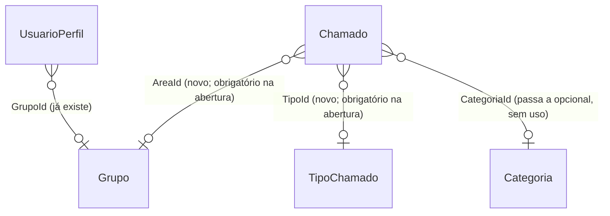

# Área e Tipo do Chamado — Design Técnico

> **Spec:** `spec.md` (AC-01 a AC-16) · **Criado em:** 2026-10-01 · **Ferramenta:** Claude Code (Opus 5.5)
> **Depende de:** `autorizacao-chamados` (mergeada em `develop`, PR #43)

---

## 1. Visão Geral da Solução

- **Área = Grupo.** O chamado ganha `AreaId`, uma FK para `Grupos`. Não nasce entidade nova: a
  lista de áreas é a lista de grupos (AC-05).
- **Tipo** é uma entidade nova, `TipoChamado` (Nome, Descrição, Ativo), mantida pelo Admin
  (AC-08). Os chamados antigos recebem o tipo fixo **"Não classificado"** (AC-11).
- **Categoria** sai de cena **sem apagar dados**. A coluna `Chamados.CategoriaId` vira opcional e
  deixa de ser usada pelo código; a tabela `Categorias` fica intacta. A remoção física (tabela e
  coluna) fica para uma limpeza futura, depois que a mudança estiver validada em produção. Isso
  mantém a migração **reversível**.
- A visibilidade ganha um critério: membro do grupo X vê também os chamados com **área X**
  (AC-07). Entra no mesmo `AplicarVisibilidade`, que continua sendo a regra única.

---

## 2. Mudanças no Domain

- **Nova entidade `TipoChamado`**, com o mesmo formato de `Categoria`/`Grupo`: construtor com
  validação, `Ativar`, `Desativar`, `Atualizar`.
- **`Chamado`:**
  - ganha `AreaId` (Guid) + navegação `Area`, e `TipoId` (Guid) + navegação `Tipo`;
  - o construtor passa a receber `areaId` e `tipoId`, e `categoriaId` sai;
  - novo método `ReclassificarTipo(Guid tipoId)` (AC-11).
- **`AcaoChamado`:** nova ação `ReclassificarTipo`, permitida a Atendente e Admin.
- **Novo repositório `ITipoChamadoRepository`**, com o mesmo formato de `ICategoriaRepository`.

### ⚠️ Mudanças de contrato

| Contrato | Antes | Depois |
|---|---|---|
| `Chamado` (construtor) | `categoriaId` | `areaId`, `tipoId` |
| `ChamadoResponse` | `categoriaId`, `categoriaNome` | `areaId`, `areaNome`, `tipoId`, `tipoNome` |
| `AbrirChamadoRequest` | `categoriaId` | `areaId`, `tipoId` |
| `GET /api/chamados` (filtros) | `categoriaId` | `areaId`, `tipoId` |
| `IChamadoRepository.ListarAsync` | `categoriaId` | `areaId`, `tipoId` |
| `IChamadoRepository.ContarPorCategoriaAsync` | por categoria | substituído por `ContarPorAreaAsync` + `ContarPorTipoAsync` |
| `DashboardMetricsResponse` | `PorCategoria` | `PorArea`, `PorTipo` |
| `RelatorioMensalResponse` (+ exportação) | `PorCategoria` | `PorArea`, `PorTipo` |
| `TriagemSugestao` | `CategoriaId/Nome`, `GrupoId/Nome` | `AreaId/Nome`, `TipoId/Nome` |
| `/api/categorias` | CRUD | **removido**; nasce `/api/tipos` (CRUD, Admin) |
| `GET /api/grupos` | Admin | liberado para leitura por qualquer usuário logado, porque o formulário de abertura precisa listar as áreas. Criar e editar continuam só Admin |
| Login / `GET /auth/me` | sem grupo | passa a devolver `grupoId`, para preencher a Área (AC-02) |

Backend e frontend precisam subir juntos, o que já é o padrão do deploy.

---

## 3. Migração de dados — ⚠️ roda no banco de produção (dev = prod)

> **Ajuste de 2026-10-02 (antes do código):** a API aplica as migrations sozinha ao iniciar
> (`Program.cs`, `MigrateAsync`) e o banco de desenvolvimento **é** o de produção. A migration vai
> rodar no primeiro teste local, enquanto a produção ainda usa o código **antigo**, até o deploy.
> Por isso a migration precisa ser **compatível com o código antigo**: nada que ele usa pode virar
> obrigatório ou sumir.

Migration EF `AddAreaETipoChamado`:

1. Cria `TiposChamado` com Guids fixos: Incidente, Dúvida, Solicitação, Customização, Melhoria
   (ativos) e **Não classificado** (inativo).
2. Para cada `Categoria` sem grupo de mesmo nome, cria o `Grupo` (hoje: Financeiro e Super e
   Tendência).
3. Adiciona `AreaId` e `TipoId` **opcionais** (nullable), com FK e índice, e preenche os chamados
   existentes: área = grupo de mesmo nome da categoria; tipo = "Não classificado".
4. `CategoriaId` passa a opcional. **Nada é apagado.**

**Compatibilidade com o código antigo em produção até o deploy:** ele continua abrindo chamados
(grava `CategoriaId` e deixa `AreaId`/`TipoId` vazios), listando e filtrando por categoria.

**Preenchimento contínuo:** o preenchimento do passo 3 (sem o passo 2, que cria áreas e roda **só na
migration**, senão recriaria áreas renomeadas pelo Admin — review R-01) roda, de forma idempotente, no
`DatabaseSeeder` a cada subida da API nova. Assim os chamados abertos pelo código antigo entre a
migration e o deploy recebem área e tipo assim que a versão nova sobe.

**O código novo exige área e tipo em toda abertura** (validação). As colunas ficam opcionais no
banco só por compatibilidade. **Limpeza futura** (outra feature, depois do deploy validado): tornar
`AreaId`/`TipoId` obrigatórias e remover `Categorias` e `CategoriaId`.

**Volta atrás:** o `Down` remove `AreaId`, `TipoId` e `TiposChamado`; `CategoriaId` **continua
opcional** (chamados abertos pela versão nova não têm categoria — review R-07). Os grupos criados no
passo 2 ficam. Usar o `Down` depois do deploy deixa os chamados novos sem área/tipo/categoria.

**Convivência até o deploy (review R-06):** enquanto a produção roda a versão antiga, não reclassificar
chamados reais pela versão nova (a versão antiga não conhece a ação de histórico nova). Fazer o deploy
de backend e frontend juntos e logo depois de aplicada a migration.

**Conferência ao aplicar:** contar os chamados por categoria antes e por área depois (precisam
bater) e conferir que nenhum chamado ficou sem área ou tipo.

---

## 4. Seeder

- **Categorias:** o seed é removido.
- **Grupos e tipos:** seed **só cria o que não existe**. Hoje o seeder sobrescreve o nome quando
  ele difere, o que desfaz as edições do Admin a cada reinício (AC-10).

---

## 5. Application / WebApi

- `AbrirChamado`: valida que `AreaId` é um grupo ativo e `TipoId` um tipo ativo.
- `ReclassificarTipoCommand` + `PATCH /api/chamados/{id}/tipo` (implementa `IRequerAcessoChamado`
  com a ação `ReclassificarTipo`).
- Tipos: `Listar`/`Criar`/`Atualizar`/`Ativar`/`Desativar`, copiando o formato da feature de
  Categorias (que é removida).
- `KeywordTriagemService`:
  - o dicionário de categorias vira dicionário de **tipos**, com palavras como "erro", "não
    funciona", "travou" → Incidente; "como faço", "dúvida" → Dúvida; "melhorar", "sugestão" →
    Melhoria; "personalizar", "customizar" → Customização; "preciso de", "solicito", "acesso" →
    Solicitação;
  - o dicionário de grupos vira o de **áreas**.
- `AplicarVisibilidade`: acrescenta `|| c.AreaId == grupoId` nos ramos com grupo (AC-07).
- Contagens do Dashboard e relatório mensal: agrupam por área e por tipo.

---

## 6. Frontend

| Tela/arquivo | Mudança |
|---|---|
| `AbrirChamadoPage` | Campos **Área** (padrão = grupo do usuário) e **Tipo**; "Sugerir" preenche os dois |
| `ChamadoDetailPage` | Mostra Área e Tipo; Atendente e Admin podem reclassificar o Tipo |
| `FiltroChamados` | Filtros de Área e de Tipo no lugar de Categoria |
| `DashboardPage` / `CategoriaChart` | Gráficos "Por área" e "Por tipo" |
| `RelatorioMensalPage` / `exportar.ts` | Quebras por área e por tipo |
| `admin/CategoriasPage` | Vira **`admin/TiposPage`** (rota `/admin/tipos`, menu "Tipos de chamado") |
| `admin/GruposPage` | Título "Áreas e Grupos" |
| `AuthContext` | Perfil guarda `grupoId` |
| Textos | Nenhuma ocorrência de "Categoria" visível ao usuário (AC-15) |

---

## 7. Pontos de toque cross-feature

| Ponto | Quem depende | Proteção |
|---|---|---|
| `Chamado` (construtor e campos) | Todos os handlers e testes que criam chamado | Os testes existentes são ajustados; build + suíte inteira |
| `AplicarVisibilidade` | Autorização (lista, detalhe, Dashboard) | Testes da autorização continuam verdes + teste do novo critério |
| `GruposController` (GET liberado) | Admin > Grupos | Escrita continua só Admin (teste) |
| Seeder | Toda subida da API | Teste manual: subir duas vezes e editar um nome entre elas |
| Relatório Mensal / Dashboard | Gestão | Conferência manual dos totais antes × depois |

---

## 8. Constitution Check

| Regra | Cumpre? | Observação |
|---|---|---|
| 1. Sem suposição silenciosa | Sim | Decisões da spec aprovadas em 2026-10-01; a lista de palavras da triagem é proposta (reversível) |
| 2. Spec antes do código | Sim | — |
| 3. Contrato sinalizado antes | Sim | Aprovado em 2026-10-02 |
| 4. Orquestração SDD | Sim | — |
| 5. Cross-feature | Sim | Seção 7 |
| 6. Obsidian | Previsto | Abertura de Chamados, Grupos e Equipes, Perfis e Permissões, Fila/Kanban/Dashboard, Relatório Mensal, Administração + ADR-008 (Área = Grupo) |

---

## 9. Perguntas em Aberto

Nenhuma. **Aprovado pelo usuário em 2026-10-02:** mudanças de contrato e migração no banco de
produção. O ajuste de compatibilidade da seção 3 deixa a migração mais segura do que a versão
aprovada e não muda nenhuma decisão de produto.
