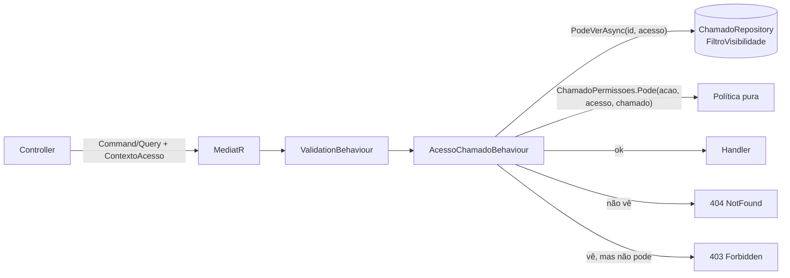

# Autorização de Chamados no Servidor — Design Técnico

> **Spec:** `spec.md` (AC-01 a AC-18) · **Criado em:** 2026-10-01 · **Ferramenta:** Claude Code (Opus 5.5)

---

## 1. Visão Geral da Solução

A regra de **quem pode ver** um chamado passa a existir em **um único lugar**: um filtro de
consulta no `ChamadoRepository`, usado tanto pela listagem quanto pela checagem de um chamado
individual. A regra de **quem pode fazer o quê** fica numa política pura, testável sem banco
(`ChamadoPermissoes`). Um *pipeline behavior* do MediatR (`AcessoChamadoBehaviour`, mesmo
mecanismo do `ValidationBehaviour` que já existe) aplica as duas a todo command e query que
declare que mexe num chamado. Assim nenhum handler precisa lembrar de checar nada, e um endpoint
novo que esqueça a checagem fica visível no código (o command não implementa a interface).



---

## 2. Mudanças no Domain

### Novos tipos

```csharp
// Domain/Enums/AcaoChamado.cs
public enum AcaoChamado
{
    Ver, ComentarPublico, ComentarInterno, Anexar,
    Assumir, Resolver, Encerrar, Reabrir, AlterarStatus, Cancelar, Editar,
    Reatribuir, AlterarPrioridade, ForcarEncerramento
}

// Domain/Common/ContextoAcesso.cs — quem está pedindo (vem do JWT, nunca do body/query)
public sealed record ContextoAcesso(Guid UsuarioId, string Email, Perfil Perfil, Guid? GrupoId);
```

### Mudanças em Interfaces — ⚠️ mudança de contrato

`IChamadoRepository`:

| Membro | Mudança | Quem usa hoje |
|---|---|---|
| `ListarAsync(...)` | Parâmetros `usuarioLogadoId`, `grupoId`, `perfil` **substituídos** por `ContextoAcesso acesso`. `solicitanteEmail` vira filtro comum (AND), não ignora mais a regra | `ListarChamadosQueryHandler` (2 chamadas), testes |
| `PodeVerAsync(Guid chamadoId, ContextoAcesso acesso)` | **Novo** | behavior |
| `ContarPorStatusAgrupadoAsync`, `ContarResolvidosHojeAsync`, `ObterTempoMedioResolucaoHorasAsync`, `ContarPorCategoriaAsync`, `ContarPorPrioridadeAsync`, `ContarSlaComplianceAsync`, `ContarPorStatusAsync` | Ganham parâmetro `ContextoAcesso acesso` (aplica o mesmo filtro) | `ObterMetricasQueryHandler`, `ObterDistribuicaoQueryHandler`, testes |

`ICurrentUserService`: ganha `string Email` (o JWT já tem o claim `email`). Aditivo; usado por
7 controllers, nenhum quebra.

---

## 3. Mudanças no Application (CQRS)

### Política de ações — `Application/Common/Autorizacao/ChamadoPermissoes.cs`

Função pura `bool Pode(AcaoChamado acao, ContextoAcesso acesso, string solicitanteEmailDoChamado)`.
Só é chamada **depois** de confirmado que o usuário vê o chamado.

| Ação | Solicitante | Atendente | Admin |
|---|:-:|:-:|:-:|
| Ver, ComentarPublico, Anexar | ✅ | ✅ | ✅ |
| ComentarInterno | — | ✅ | ✅ |
| Cancelar | só se abriu (e-mail = do chamado) | ✅ | ✅ |
| Assumir, Resolver, Encerrar, Reabrir, AlterarStatus, Editar | — | ✅ | ✅ |
| Reatribuir, AlterarPrioridade, ForcarEncerramento | — | — | ✅ |

### Marcação de requests — `IRequerAcessoChamado`

```csharp
public interface IRequerAcessoChamado
{
    Guid ChamadoId { get; }
    AcaoChamado Acao { get; }
    ContextoAcesso Acesso { get; }
}
```

Implementada por: `ObterChamadoPorIdQuery`, `ListarComentariosQuery`, `ListarHistoricoQuery`,
`ListarAnexosQuery`, `ObterUrlDownloadAnexoQuery` (Ver); `ComentarChamadoCommand`
(ComentarPublico ou ComentarInterno conforme o flag); `AdicionarAnexoCommand`,
`RemoverAnexoCommand` (Anexar; a regra "só os seus" do remover continua no handler);
`AtribuirChamadoCommand` (Assumir); `ResolverChamadoCommand`; `FecharChamadoCommand` (Encerrar);
`ReabrirChamadoCommand`; `AlterarStatusChamadoCommand`; `CancelarChamadoCommand`;
`ReatribuirChamadoCommand`; `AlterarPrioridadeChamadoCommand`; `ForcarEncerramentoChamadoCommand`;
`AtualizarChamadoCommand` (PUT `/{id}`, ação Editar).

Os records ganham o parâmetro `ContextoAcesso Acesso`, preenchido pelo controller (o padrão
atual já passa `_currentUser.*` do controller para o command).

### `AcessoChamadoBehaviour<TRequest, TResponse>`

1. Se o request não é `IRequerAcessoChamado`, passa adiante.
2. `PodeVerAsync` falso → `NotFoundException("Chamado", id)` (AC-16: não revela que existe).
3. Se a ação é `Cancelar` e o perfil é Solicitante, carrega o chamado para comparar o e-mail.
4. `ChamadoPermissoes.Pode` falso → `ForbiddenException("Você não tem permissão para realizar esta ação neste chamado.")`.
5. Chama o handler.

Registrado depois do `ValidationBehaviour` (request inválido falha antes de ir ao banco).

### Handlers alterados

- `ListarChamadosQueryHandler`: repassa `ContextoAcesso` em vez dos 3 campos soltos.
- `AbrirChamadoCommandHandler`: nada muda; quem muda é o controller, que preenche
  `SolicitanteNome/Email` a partir do usuário logado (AC-12).
- `ObterMetricasQueryHandler` e `ObterDistribuicaoQueryHandler`: recebem `ContextoAcesso` e o
  repassam às contagens (AC-13). Solicitante → `ForbiddenException` (a matriz não dá Dashboard a
  Solicitante).
- `ForcarEncerramentoChamadoCommandHandler`: a checagem de perfil que já existe nele fica (a
  redundância é inofensiva) ou é removida. Decide-se na implementação, mantendo o teste.

---

## 4. Mudanças no Infrastructure

### Migrations
**Nenhuma.** Não há mudança de schema.

### `ChamadoRepository` — filtro único de visibilidade

```csharp
private IQueryable<Chamado> AplicarVisibilidade(IQueryable<Chamado> q, ContextoAcesso a)
{
    if (a.Perfil == Perfil.Admin) return q;                       // AC-11 (com ou sem grupo)
    var email = a.Email.ToLower();

    // Membro do grupo = abriu OU é responsável (definição revisada em 2026-10-01)
    Expression<Func<Chamado, bool>> doGrupo = c => a.GrupoId.HasValue &&
        _context.UsuariosPerfil.Any(u => u.GrupoId == a.GrupoId &&
            (u.Id == c.ResponsavelId || u.Email == c.SolicitanteEmail.ToLower()));

    return a.Perfil == Perfil.Atendente
        ? q.Where(c => c.ResponsavelId == null || c.ResponsavelId == a.UsuarioId
                       || c.SolicitanteEmail.ToLower() == email || doGrupo)   // AC-08
        : q.Where(c => c.SolicitanteEmail.ToLower() == email || doGrupo);     // AC-01/02
}
```
(Pseudocódigo: a composição real das expressões fica na implementação, para que o EF traduza
tudo para SQL.)

- `ListarAsync`, `PodeVerAsync` (`AnyAsync`) e as contagens do Dashboard usam este método.
- O ramo antigo `if (grupoId.HasValue && usuarioLogadoId.HasValue)` e a exceção que ignorava
  `solicitanteEmail` são removidos.
- O e-mail é comparado em minúsculas. `UsuarioPerfil.Email` já é gravado assim, mas chamados
  antigos podem ter e-mail com maiúsculas.

### `DatabaseSeeder` — não muda nesta feature.

---

## 5. Mudanças no WebApi

| Endpoint | Mudança |
|---|---|
| `GET /api/chamados` | Passa `ContextoAcesso`. Parâmetro `solicitanteEmail` vira filtro adicional |
| `GET /api/chamados/{id}` e sub-recursos | 404 quando não pode ver (AC-03, AC-16) |
| `POST /api/chamados` | `SolicitanteNome/Email` vêm de `_currentUser`; os campos do body são ignorados (AC-12). O DTO é mantido para não quebrar o cliente |
| Ações (`PATCH /{id}/...`, `PUT /{id}`, `PUT /{id}/status`) | 404 se não vê; 403 se vê mas não pode (AC-05, AC-06, AC-09) |
| `POST /{id}/comentarios` com `interno=true` por Solicitante | 403 (AC-10) |
| `GET /api/dashboard/*` | Contagens no escopo do usuário; Solicitante → 403 |
| **SignalR** `ComentarioAdicionado`, `ChamadoCriado`, `SlaAtencao`, `SlaAtrasado` | Payload sem conteúdo nem título (só id, número e status). O cliente rebusca pela API, que já aplica a regra (AC-19) |
| `GET /api/relatorios/mensal` | Solicitante → 403; Atendente → `responsavelId` = o próprio id (AC-21) |

`CurrentUserService` ganha `Email` (claim `JwtRegisteredClaimNames.Email`) e um helper
`ContextoAcesso ObterContextoAcesso()`.

---

## 6. Mudanças no Frontend

| Arquivo | Mudança |
|---|---|
| `ChamadoDetailPage.tsx:299` | Remove o bloqueio "não pertence ao seu perfil". Quem decide é o servidor; 404 mostra "Chamado não encontrado" (AC-04) |
| `ChamadoDetailPage.tsx` (botões) | Cancelar só aparece para Solicitante se ele abriu o chamado (AC-06). Demais ações seguem a matriz |
| `ChamadosListPage.tsx:49`, `ArquivoChamadosPage.tsx:27` | Solicitante para de mandar `solicitanteEmail`; o servidor aplica a regra. Mandar continuaria escondendo os chamados do grupo (AC-02) |
| `AbrirChamadoPage.tsx:78` | Para de mandar nome e e-mail do solicitante (o servidor ignora) |
| `useSignalR` / `AppLayout` / `signalr-events.ts` | Ajustar aos payloads reduzidos (o toast de SLA mostra "CAM-123 — próximo do prazo" sem título) |

---

## 7. Pontos de toque cross-feature (Constitution regra 5)

| Ponto | Quem mais depende | Comportamento que muda de propósito | Proteção contra regressão |
|---|---|---|---|
| `ChamadoRepository.ListarAsync` | Meus Chamados, Arquivo, Fila, Kanban, busca por número | **Atendente sem grupo deixa de ver tudo** no Kanban/busca: passa a ver fila + seus + os que abriu (AC-08, decisão aprovada) | Testes por perfil (AC-17) + verificação manual do Kanban com Atendente |
| Contagens do Dashboard | Dashboard, toasts de métricas | Atendente vê números do seu escopo; Admin igual a hoje | Teste: Admin com grupo = totais globais |
| `ICurrentUserService` | 7 controllers + Chat | Nenhum (aditivo) | Build |
| Todos os commands/queries de chamado | Fluxo de atendimento inteiro | Solicitante perde ações que nunca deveria ter tido | Testes do behavior por ação × perfil; os testes de handler existentes continuam passando |
| SignalR (eventos de chamado) | Kanban, Fila, Detalhe, toasts de SLA, Dashboard | Payloads sem texto | Verificação manual: comentar em uma aba e ver atualizar na outra |
| `ForcarEncerramento` (checagem de perfil própria) | feature `forcar-encerramento` | Nenhum | Testes existentes |

| `RelatoriosController` | Relatório Mensal | Solicitante perde acesso; Atendente sempre recebe os próprios números | Verificação manual com Atendente e com Admin |

Fora destes, nenhum arquivo de Chat, Usuários ou Grupos é tocado.

---

## 8. Constitution Check

| Regra | Cumpre? | Observação |
|---|---|---|
| 1. Pergunta sem resposta não vira suposição | Sim | As 3 perguntas do design foram respondidas (seção 9) |
| 2. Spec antes do código | Sim | Spec aprovada; definição de grupo revisada e reaprovada antes do design |
| 3. Mudança de contrato sinalizada antes | Sim | Seção 2, apresentada ao usuário antes de implementar |
| 4. Orquestração SDD | Sim | Fluxo `/sdd`, review por sub-agente independente |
| 5. Não quebrar fora do escopo | Sim | Seção 7 |
| 6. Obsidian atualizado | Previsto | `Perfis e Permissões`, `Grupos e Equipes` no fechamento |

---

## 9. Decisões tomadas na parada do Plan (usuário, 2026-10-01)

1. **Tempo real (SignalR): incluído** (spec AC-19). Os payloads de `ComentarioAdicionado`,
   `ChamadoCriado`, `SlaAtencao` e `SlaAtrasado` levam só id, número e status.
2. **`PUT /api/chamados/{id}`: só Atendente e Admin** (spec AC-20). Nova ação `AcaoChamado.Editar`
   na política.
3. **Relatório Mensal: incluído o mínimo** (spec AC-21). No `RelatoriosController`, Solicitante →
   403 e Atendente → `responsavelId` forçado para o próprio id.
4. **Mudanças de contrato da seção 2: aprovadas.**

Sem perguntas em aberto.
