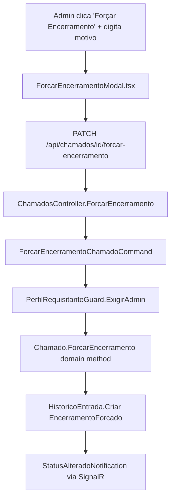

# Forçar Encerramento — Design

**Spec**: `.specs/features/forcar-encerramento/spec.md`
**Status**: Draft

---

## Architecture Overview

Segue o padrão CQRS já usado por toda ação de chamado no projeto (Reatribuir, AlterarPrioridade, Fechar): um novo Command + Handler + Validator na feature `Chamados`, um método novo no agregado `Chamado`, uma entrada de `HistoricoEntrada`, e um endpoint no `ChamadosController` existente. Nenhum componente novo de infraestrutura.

---

## Code Reuse Analysis

### Existing Components to Leverage

| Component | Location | How to Use |
|---|---|---|
| `PerfilRequisitanteGuard.ExigirAdmin` | `Application/Common/Authorization/PerfilRequisitanteGuard.cs` | Chamar no início do novo Handler, mesmo padrão do `Usuarios` |
| `ICurrentUserService` | `Application/Common/ICurrentUserService.cs` | Controller extrai `UsuarioId`/`Nome`/`Perfil` do JWT, como já faz em todos os endpoints de ação |
| `IHistoricoRepository` | já injetado nos outros Handlers de Chamados | `AdicionarAsync` (padrão usado por Reatribuir) para registrar o histórico com o motivo |
| `StatusAlteradoNotification` | `Application/Common/Notifications` | Reaproveitar igual a Fechar/Cancelar/Reatribuir — nenhuma notificação nova |
| `AlterarPrioridadeModal.tsx` + `useAlterarPrioridadeChamado` (`useAcoesChamado.ts`) | `frontend/src/features/chamados/` | Modelo de modal + hook de mutation a seguir para o novo `ForcarEncerramentoModal` |
| `apiFetch` | `frontend/src/lib/api` (padrão já usado em todos os hooks) | Chamada HTTP do novo endpoint |

### Integration Points

| System | Integration Method |
|---|---|
| `ChamadosController` (existente) | Novo endpoint `PATCH /api/chamados/{id}/forcar-encerramento`, mesmo controller dos outros PATCHs de ação |
| PostgreSQL (`HistoricoEntradas`) | Sem migration — novo valor de enum cabe no `HasMaxLength(30)` existente; motivo vai em `DetalheNovo` (`text`, já sem limite) |
| SignalR (`StatusAlteradoNotification`) | Reaproveitado sem mudança — frontend já escuta esse evento genérico |

---

## Components

### `Chamado.ForcarEncerramento()` (Domain)

- **Purpose**: Fecha o chamado a partir de qualquer status não-final, bypassando a exigência normal de `Fechar()` (que exige `Resolvido`)
- **Location**: `src/ChamadosCamarj.Domain/Entities/Chamado.cs`
- **Interfaces**:
  - `void ForcarEncerramento()` — lança `InvalidOperationException` se `Status` já for `Fechado` ou `Cancelado`; caso contrário seta `Status = Fechado`, preenche `DataConclusao ??= DateTime.UtcNow` (preserva se já setada por um `Resolver()` anterior), e `DataAtualizacao = DateTime.UtcNow`
- **Dependencies**: Nenhuma nova
- **Reuses**: Mesmo formato de guard de status usado em `Fechar()`/`Cancelar()`/`AlterarPrioridade()`

### `ForcarEncerramentoChamadoCommand` + Handler + Validator (Application)

- **Purpose**: Orquestra a ação — valida motivo, exige Admin, aplica no domínio, persiste, audita, notifica
- **Location**: `src/ChamadosCamarj.Application/Features/Chamados/Commands/`
- **Interfaces**:
  - `record ForcarEncerramentoChamadoCommand(Guid Id, string Motivo, Guid? UsuarioId = null, string UsuarioNome = "Sistema", string? PerfilRequisitante = null) : IRequest`
  - `ForcarEncerramentoChamadoCommandHandler.Handle(...)`: guard de Admin → busca chamado (404 se não achar) → `chamado.ForcarEncerramento()` → `AtualizarAsync` → `HistoricoEntrada.Criar(..., AcaoHistorico.EncerramentoForcado, detalheAnterior: statusAnterior, detalheNovo: motivo)` via `AdicionarAsync` → publica `StatusAlteradoNotification`
  - `ForcarEncerramentoChamadoCommandValidator`: `Motivo` não vazio, `MinimumLength(10)`, `MaximumLength(500)`
- **Dependencies**: `IChamadoRepository`, `IHistoricoRepository`, `IPublisher`, `PerfilRequisitanteGuard`
- **Reuses**: Estrutura idêntica a `ReatribuirChamadoCommandHandler`/`FecharChamadoCommandHandler`

### `AcaoHistorico.EncerramentoForcado` (Domain enum)

- **Purpose**: Distinguir no histórico um encerramento forçado de um `Fechado` normal (auditoria clara para quem revisar depois)
- **Location**: `src/ChamadosCamarj.Domain/Enums/AcaoHistorico.cs`
- **Interfaces**: novo valor `EncerramentoForcado = 10` (append ao final, não renumerar os existentes)
- **Dependencies**: nenhuma — sem migration (ver Notas Técnicas do spec)

### `ChamadosController.ForcarEncerramento` (WebApi)

- **Purpose**: Expor a ação via HTTP
- **Location**: `src/ChamadosCamarj.WebApi/Controllers/ChamadosController.cs`
- **Interfaces**:
  - `[HttpPatch("{id:guid}/forcar-encerramento")]` recebendo `[FromBody] ForcarEncerramentoRequest(string Motivo)`, montando o command com `_currentUser.UsuarioId`, `_currentUser.Nome`, `_currentUser.Perfil`
  - Retorna `204 NoContent` (sucesso), `403` (guard), `404` (não encontrado), `400` (motivo inválido ou status já final)
- **Dependencies**: `IMediator`, `ICurrentUserService` (já injetados no controller)
- **Reuses**: Mesmo formato de `Fechar`/`Cancelar`/`Reatribuir` no mesmo controller

### `ForcarEncerramentoModal.tsx` + `useForcarEncerramentoChamado` (Frontend)

- **Purpose**: UI para o Admin informar o motivo e confirmar a ação
- **Location**: `frontend/src/features/chamados/components/ForcarEncerramentoModal.tsx` + hook em `frontend/src/features/chamados/hooks/useAcoesChamado.ts`
- **Interfaces**:
  - Modal com `Textarea` (motivo), contador de caracteres (10-500), botão desabilitado até o mínimo ser atingido
  - Botão "Forçar Encerramento" no `ChamadoDetailPage`, visível **só para Admin** e só quando `Status` não é `Fechado`/`Cancelado` — estilo `variant="destructive"` (ação excepcional, visualmente distinta de Fechar/Cancelar normais)
- **Dependencies**: `apiFetch`, `useQueryClient` (invalidar chamado + histórico após sucesso)
- **Reuses**: Estrutura de `AlterarPrioridadeModal.tsx` (Dialog + mutation hook + erro inline)

---

## Data Models

Nenhum modelo novo. `HistoricoEntrada` já existente é reaproveitado (`Acao = EncerramentoForcado`, `DetalheAnterior = status anterior`, `DetalheNovo = motivo`). Nenhuma migration necessária.

---

## Error Handling Strategy

| Error Scenario | Handling | User Impact |
|---|---|---|
| Não-Admin chama o endpoint | `PerfilRequisitanteGuard.ExigirAdmin` lança `ForbiddenException` → 403 | Frontend não deveria nem mostrar o botão, mas o backend bloqueia igual |
| Chamado não existe | `NotFoundException` → 404 | Mensagem de erro padrão já usada nos outros endpoints |
| Chamado já Fechado/Cancelado | `Chamado.ForcarEncerramento()` lança `InvalidOperationException` → 400 (pipeline já mapeia isso, mesmo padrão de `Fechar()`/`Cancelar()`) | Erro inline no modal |
| Motivo vazio ou fora do range 10-500 | FluentValidation → `ValidationException` → 400 | Erro inline no modal, mesmo padrão dos outros formulários |

---

## Tech Decisions (só as não-óbvias)

| Decisão | Escolha | Rationale |
|---|---|---|
| Novo enum `EncerramentoForcado` em vez de reaproveitar `AcaoHistorico.Fechado` | Valor novo | Auditoria precisa distinguir um fechamento normal (via `Resolvido`) de um forçado — quem revisar o histórico depois (ex: Relatório Mensal, auditoria interna) precisa dessa diferença visível |
| `DataConclusao ??= UtcNow` (não sobrescreve) | Preserva a data original se o chamado já tinha passado por `Resolvido` antes de ser forçado | Consistente com a lição já registrada em `STATE.md` sobre `DataConclusao` ser a fonte confiável de "quando terminou" para Relatório Mensal/Arquivo |
| Guard de Admin real no backend (não só UI) | `PerfilRequisitanteGuard.ExigirAdmin` | Ação bypassa um invariante de domínio — mais sensível que Reatribuir/AlterarPrioridade (que hoje só têm RBAC soft, um débito técnico já conhecido e não replicado aqui) |
| Min/max do motivo: 10-500 caracteres | Segue a régua de campos de texto curtos do projeto (nome: 150, descrição: 5000, comentário: 10000) — 500 é generoso pra uma justificativa sem virar um campo de texto livre longo. Mínimo de 10 evita "x"/"ok" | Ajustável — sinalizar se quiser outro valor |

---

## Não coberto por este design (fora de escopo, ver spec.md)

- Botão "Forçar Encerramento" não aparece no Kanban/Fila (card), só no Detalhe do Chamado — ação excepcional não precisa de atalho na lista
