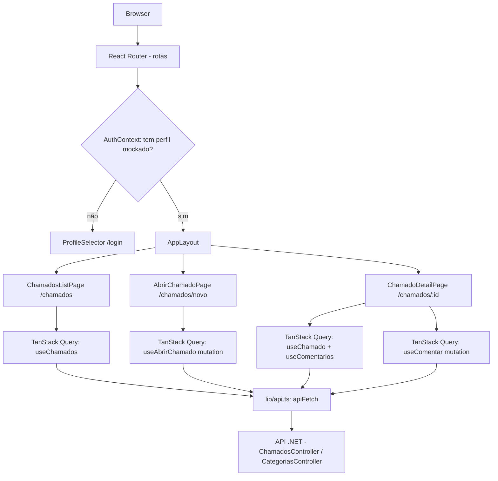

# Fase 3 — Portal do Solicitante Design

**Spec**: `.specs/features/frontend-portal-solicitante/spec.md`
**Status**: Draft

---

## Research (Knowledge Verification Chain)

Bibliotecas confirmadas via busca na web em 2026-06-19 (não confiar em conhecimento de treinamento desatualizado pra essas — versões mudam rápido):

| Biblioteca | Versão atual confirmada | Fonte |
|------------|--------------------------|-------|
| React Router | v8.0.1 (upgrade de v7 é não-breaking) | [reactrouter.com](https://reactrouter.com/start/declarative/installation) |
| shadcn/ui CLI | comando é `shadcn` (não `shadcn-ui`, nome antigo) | [ui.shadcn.com/docs/installation/vite](https://ui.shadcn.com/docs/installation/vite) |
| TailwindCSS (via shadcn/vite) | v4, plugin `@tailwindcss/vite` (não mais `postcss`+`autoprefixer` manual) | busca + docs shadcn |
| TanStack Query | v5 — `isPending` é o campo recomendado (substituiu `isLoading` como padrão) | [tanstack.com/query/v5](https://tanstack.com/query/v5/docs/framework/react/quick-start) |

**Comandos a confirmar no momento do Execute** (podem ter mudado entre a pesquisa e a implementação real — re-confirmar é rápido, assumir errado custa retrabalho):
- `npm create vite@latest frontend -- --template react-ts`
- `npx shadcn@latest init` / `npx shadcn@latest add <componente>`
- `npm install react-router@latest @tanstack/react-query`

---

## Architecture Overview

SPA React servida separadamente da API (.NET). Em dev, Vite roda em `localhost:5173` e consome a API em `localhost:5000` (CORS já liberado em `Program.cs` pra essas duas origens). Sem SSR, sem framework mode do React Router — só roteamento declarativo client-side, já que não há necessidade de loaders/actions no servidor nesta fase.



---

## Pré-requisito de Backend: API-01

Antes do frontend poder mostrar comentários, precisa existir um endpoint que retorne o conteúdo deles (hoje só existe `QuantidadeComentarios`).

### Componente: ListarComentariosQuery (backend)

- **Purpose**: Retornar todos os comentários de um chamado, ordenados por data
- **Location**: `src/ChamadosCamarj.Application/Features/Chamados/Queries/ListarComentariosQuery.cs` + Handler
- **Reuses**: Mesmo padrão CQRS de `ListarChamadosQuery`/`ObterChamadoPorIdQuery`. Adiciona `Task<IEnumerable<Comentario>> ObterComentariosPorChamadoAsync(Guid chamadoId, CancellationToken)` em `IChamadoRepository` (implementação via `_context.Set<Comentario>().Where(c => c.ChamadoId == chamadoId).OrderBy(c => c.DataCriacao).AsNoTracking().ToListAsync()`)
- **Novo DTO**: `ComentarioResponse(Guid Id, string Autor, string Conteudo, TipoComentario Tipo, DateTime DataCriacao)`
- **Endpoint**: `GET /api/chamados/{id}/comentarios` em `ChamadosController` → `[HttpGet("{id:guid}/comentarios")]`
- **Decisão de design**: o endpoint retorna **todos** os comentários (público + interno), sem filtrar por perfil — não existe RBAC real no backend ainda (mesma limitação documentada no spec). O **frontend filtra** pra mostrar só `Tipo === "Publico"` na visão do Solicitante. Isso evita reescrever o endpoint quando a visão de Atendente (Fase 5) precisar ver os comentários internos também.

---

## Code Reuse Analysis

### Existing Components to Leverage

| Componente | Localização | Como usar |
|------------|-------------|-----------|
| `ChamadosController` | `src/ChamadosCamarj.WebApi/Controllers/` | Endpoints já existentes: `GET /chamados`, `GET /chamados/{id}`, `POST /chamados`, `POST /chamados/{id}/comentarios` |
| `CategoriasController` | `src/ChamadosCamarj.WebApi/Controllers/` | `GET /categorias` pra popular o select do formulário de abertura |
| `ExceptionHandlingMiddleware` | `src/ChamadosCamarj.WebApi/Middleware/` | Já retorna erros em formato previsível (`{message}` ou `{errors:[{campo,erro}]}`) — o cliente HTTP do frontend espera exatamente esse formato |
| Enums (`StatusChamado`, `PrioridadeChamado`, `TipoComentario`) | `src/ChamadosCamarj.Domain/Enums/` | Serializados como string (JsonStringEnumConverter) — replicar como union types no TS |

### Integration Points

| Sistema | Método de integração |
|---------|----------------------|
| API REST (.NET) | `fetch` via wrapper tipado em `lib/api.ts`, base URL configurável por env var |
| CORS | Já liberado em `Program.cs` pra `localhost:5173` (Vite dev) e `localhost:3000` |

---

## Components

### AuthContext (mock auth)

- **Purpose**: Guardar o perfil mockado ativo e expor pra aplicação inteira
- **Location**: `frontend/src/auth/AuthContext.tsx`
- **Interfaces**:
  - `useAuth(): { perfil: Perfil | null, login(perfil: TipoPerfil): void, logout(): void }`
- **Dependencies**: `localStorage` (persistência entre reloads)
- **Reuses**: nada — é novo, mas isolado o suficiente pra ser substituído por MSAL depois sem tocar nas telas
- **Dados mockados fixos** (decisão de design, ajustável):
  | Perfil | Nome | Email |
  |--------|------|-------|
  | Admin | Victor | victor@camarj.com.br |
  | Atendente | Fábio | fabio@camarj.com.br |
  | Solicitante | Ana Colaboradora | ana.colaboradora@camarj.com.br |

### ProfileSelector

- **Purpose**: Tela `/login` com 3 cards (Admin/Atendente/Solicitante) pra escolher o mock
- **Location**: `frontend/src/auth/ProfileSelector.tsx`
- **Dependencies**: `AuthContext.login()`, componentes shadcn (`Card`, `Button`)

### AppLayout

- **Purpose**: Header com nome do perfil ativo + botão "sair" (chama `logout()`) + `<Outlet />` pras rotas filhas
- **Location**: `frontend/src/layouts/AppLayout.tsx`
- **Dependencies**: `AuthContext`, React Router `<Outlet />`

### lib/api.ts — cliente HTTP

- **Purpose**: Wrapper único sobre `fetch`, normaliza erros no formato do `ExceptionHandlingMiddleware`
- **Location**: `frontend/src/lib/api.ts`
- **Interfaces**:
  - `apiFetch<T>(path: string, options?: RequestInit): Promise<T>` — lança `ApiError` em respostas não-2xx
  - `class ApiError extends Error { status: number; errors?: {campo: string; erro: string}[] }`
- **Dependencies**: `VITE_API_BASE_URL` (env var, default `http://localhost:5000/api`)

### features/chamados/api.ts — funções de API específicas

- **Purpose**: Funções tipadas que chamam `apiFetch` pra cada endpoint de chamados/categorias
- **Location**: `frontend/src/features/chamados/api.ts`
- **Interfaces**:
  - `listarChamados(filtros: ListarChamadosFiltros): Promise<PagedResult<ChamadoResponse>>`
  - `obterChamado(id: string): Promise<ChamadoResponse>`
  - `abrirChamado(dados: AbrirChamadoRequest): Promise<ChamadoResponse>`
  - `listarComentarios(chamadoId: string): Promise<ComentarioResponse[]>`
  - `comentar(chamadoId: string, dados: ComentarChamadoRequest): Promise<void>`
  - `listarCategorias(): Promise<CategoriaResponse[]>`

### Hooks (TanStack Query)

- **Location**: `frontend/src/features/chamados/hooks/`
- `useChamados(filtros)` → `useQuery({ queryKey: ['chamados', filtros], queryFn: () => listarChamados(filtros) })`
- `useChamado(id)` → `useQuery({ queryKey: ['chamado', id], queryFn: () => obterChamado(id) })`
- `useComentarios(chamadoId)` → `useQuery({ queryKey: ['comentarios', chamadoId], queryFn: () => listarComentarios(chamadoId) })`
- `useAbrirChamado()` → `useMutation` que invalida `['chamados']` no sucesso
- `useComentar(chamadoId)` → `useMutation` que invalida `['comentarios', chamadoId]` no sucesso

### Páginas

| Página | Rota | Componente | Requisitos |
|--------|------|------------|------------|
| Seleção de perfil | `/login` | `ProfileSelector` | FE-01 |
| Abrir chamado | `/chamados/novo` | `AbrirChamadoPage` | FE-02 |
| Lista de chamados | `/chamados` | `ChamadosListPage` | FE-03 |
| Detalhe do chamado | `/chamados/:id` | `ChamadoDetailPage` | FE-04, FE-05 |

### Componentes de UI específicos

- `ChamadoCard` — card na lista (título, status badge, prioridade, SLA badge)
- `FiltroChamados` — selects de status/categoria + busca por texto
- `ComentarioList` / `ComentarioForm` — timeline de comentários públicos + form de novo comentário
- `SlaBadge` — calcula visualmente se `dataLimite` já passou (FE-06)
- `StatusBadge` / `PrioridadeBadge` — mapeiam enum → cor (shadcn `Badge`)

---

## Data Models

```typescript
// frontend/src/types/api.ts — espelha os DTOs do backend (.NET records)

export type StatusChamado = "Aberto" | "EmAndamento" | "Resolvido" | "Fechado" | "Cancelado";
export type PrioridadeChamado = "Baixa" | "Media" | "Alta" | "Urgente";
export type TipoComentario = "Publico" | "Interno";

export interface ChamadoResponse {
  id: string;
  titulo: string;
  descricao: string;
  status: StatusChamado;
  prioridade: PrioridadeChamado;
  solicitanteNome: string;
  solicitanteEmail: string;
  responsavelId: string | null;
  responsavelNome: string | null;
  categoriaId: string;
  categoriaNome: string | null;
  dataLimite: string | null; // ISO 8601
  dataConclusao: string | null;
  dataCriacao: string;
  dataAtualizacao: string | null;
  quantidadeComentarios: number;
  quantidadeAnexos: number;
}

export interface ComentarioResponse {
  id: string;
  autor: string;
  conteudo: string;
  tipo: TipoComentario;
  dataCriacao: string;
}

export interface CategoriaResponse {
  id: string;
  nome: string;
  descricao: string;
  ativa: boolean;
}

export interface PagedResult<T> {
  items: T[];
  total: number;
  pagina: number;
  tamanhoPagina: number;
  totalPaginas: number;
  temProxima: boolean;
  temAnterior: boolean;
}

export interface AbrirChamadoRequest {
  titulo: string;
  descricao: string;
  solicitanteNome: string;
  solicitanteEmail: string;
  categoriaId: string;
  prioridade?: PrioridadeChamado;
}

export interface ComentarChamadoRequest {
  autor: string;
  conteudo: string;
  interno: boolean;
}
```

**Relacionamentos**: `ChamadoResponse.categoriaId` referencia `CategoriaResponse.id`. `ComentarioResponse` não tem FK explícita no DTO (vem aninhado na resposta de `GET /chamados/{id}/comentarios`, já filtrado por chamado).

---

## Error Handling Strategy

| Cenário | Tratamento | Impacto no usuário |
|---------|-----------|---------------------|
| 404 (chamado/categoria não encontrado) | `ApiError.status === 404` → página/mensagem "não encontrado" | Mensagem amigável, link de volta |
| 400 com `errors[]` (validação FluentValidation) | Mapear `campo` → mensagem inline no formulário (React Hook Form `setError`) | Erro aparece embaixo do campo certo |
| 400 com `message` (transição de status inválida / `InvalidOperationException`) | Toast/alert com a mensagem da API | Usuário entende por que a ação não foi permitida |
| 500 genérico | Toast genérico "Algo deu errado, tente novamente" | Não expõe detalhes internos (já garantido pelo middleware) |
| Erro de rede (API fora do ar) | `ApiError` sem status (fetch rejeitou) → mensagem "serviço indisponível" | Diferente de 500, mensagem específica de conectividade |
| TanStack Query retry | Desabilitar retry automático em mutations (evita reenviar POST duplicado); manter retry padrão (3x) em queries de leitura | Leitura resiliente a falha transitória, escrita não duplica |

---

## Tech Decisions

| Decisão | Escolha | Racional |
|---------|---------|----------|
| Roteamento | React Router v8, modo declarativo (`BrowserRouter`/`Routes`/`Route`) | SPA simples, sem necessidade de loaders/actions de servidor. Upgrade futuro pro modo framework é opcional, não bloqueante |
| Data fetching | TanStack Query v5 | Cache, invalidação e estados de loading/erro de graça — evita reimplementar isso à mão pra cada chamada |
| Formulários | React Hook Form | Já estava na visão original do `docs/SPEC.md`; integra bem com mapeamento de erros de campo da API |
| HTTP client | `fetch` nativo + wrapper fino (não axios) | Reduz dependência; o wrapper já cobre o necessário (base URL, JSON, erro tipado) |
| Identidades mockadas | 3 perfis fixos (tabela acima), não um formulário de "digitar email" | Mais simples de testar e documentar; pode evoluir pra formulário livre se o usuário pedir |
| Filtro público/interno de comentários | No frontend, não no backend | Endpoint genérico reutilizável pela visão de Atendente (Fase 5) sem precisar de outro endpoint |

---

## Confirmação necessária

Componentes shadcn/ui a instalar (mínimo pro MVP): `button`, `card`, `input`, `select`, `badge`, `textarea`, `label`, `alert`, `skeleton`.
