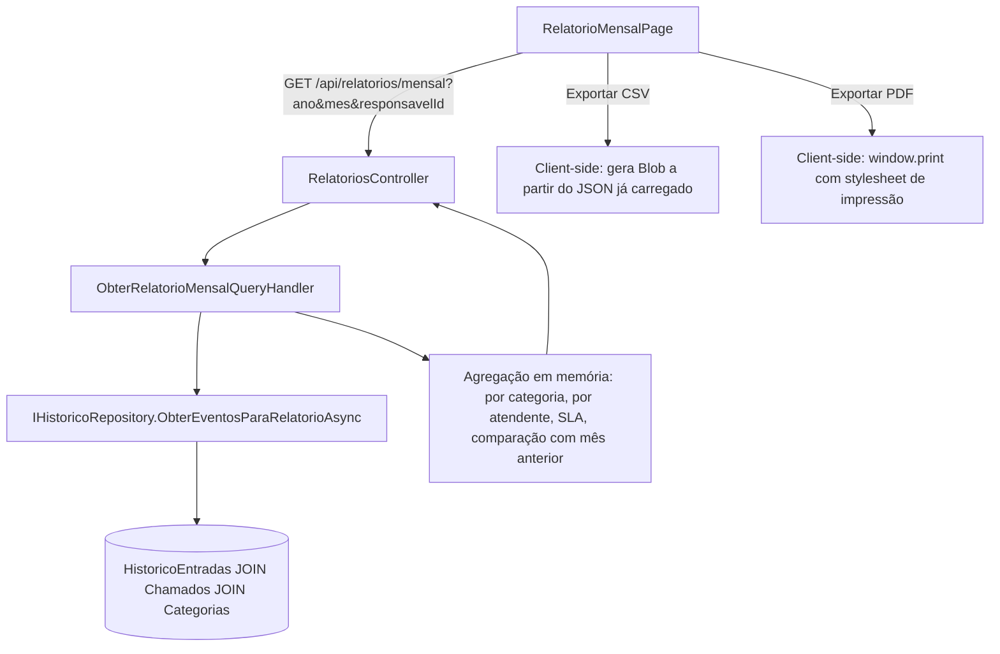

# Relatório Mensal — Design

**Spec**: `.specs/features/relatorio-mensal/spec.md`
**Status**: Concluído (verificado em 2026-07-15)

---

## Architecture Overview

O relatório é uma **query de leitura pura** (CQRS), sem novo estado persistido. A fonte da verdade de "quando" cada evento aconteceu é o `HistoricoEntrada` (auditoria da Fase 6), não os campos mutáveis do `Chamado` — isso é o que garante REL-10 (integridade dos dados): um chamado resolvido em julho e fechado em agosto continua contando como "resolvido em julho", porque o evento `Resolvido` no histórico tem `DataHora` = julho, independente do `Status` atual do chamado.



---

## Code Reuse Analysis

### Existing Components to Leverage

| Component | Location | How to Use |
|---|---|---|
| `ObterMetricasQueryHandler` (padrão CQRS de métricas) | `src/ChamadosCamarj.Application/Features/Dashboard/Queries/` | Mesmo padrão de handler injetando repositório e montando um DTO agregado — não reaproveita código diretamente (esse é "agora", o relatório é "por período"), mas segue a mesma estrutura |
| `ObterTendenciaAsync` (query período-limitada, corrigida nesta sessão) | `ChamadoRepository.cs` | Mesmo princípio: cada métrica filtra pela sua própria data de evento (`DataCriacao` vs `DataConclusao`), nunca uma pela outra |
| `DashboardKpi` (componente de card de métrica) | `frontend/src/features/dashboard/DashboardKpi.tsx` | Reaproveitado tal como está para os cards de totais do relatório |
| `CategoriaChart` (gráfico de barra por categoria) | `frontend/src/features/dashboard/CategoriaChart.tsx` | Reaproveitado para a quebra "por categoria"; um componente análogo (`PorAtendenteChart`) é criado por espelhamento para "por atendente" |
| `AuthContext` / `useAuth()` | `frontend/src/auth/AuthContext.tsx` | Fonte do `perfil.tipo`/`perfil.id` para decidir a visão (Admin vê tudo, Atendente vê só o próprio `responsavelId`) |
| Gate de navegação `perfil.tipo !== 'Solicitante'` | `frontend/src/layouts/AppLayout.tsx:48` | Mesmo gate usado por Kanban/Dashboard/Fila — o novo link "Relatório Mensal" entra no mesmo bloco, sem lógica nova de RBAC |
| `apiFetch`/`ApiError` | `frontend/src/lib/api.ts` | Toda chamada HTTP do relatório passa por aqui, como o resto do app |

### Integration Points

| Sistema | Método de integração |
|---|---|
| `HistoricoEntrada` (tabela) | Nova query no `IHistoricoRepository` faz `JOIN` com `Chamados`/`Categorias` para trazer, num único round-trip, os eventos do período já com o contexto (categoria, atendente, prazo) necessário pra agregação |
| PDF/CSV | **Nenhuma biblioteca nova.** CSV é montado no cliente a partir do JSON já carregado (mesmo dado da tela). PDF usa `window.print()` do navegador com uma folha de estilo `@media print` dedicada — ver Tech Decisions |

---

## Components

### Backend — `RelatoriosController`

- **Purpose**: Expor o endpoint HTTP do relatório mensal
- **Location**: `src/ChamadosCamarj.WebApi/Controllers/RelatoriosController.cs`
- **Interfaces**:
  - `GET /api/relatorios/mensal?ano={int}&mes={int}&responsavelId={guid?}` → `RelatorioMensalResponse`
- **Dependencies**: `IMediator`
- **Reuses**: Mesma estrutura de `DashboardController` (thin controller, delega tudo pro handler via MediatR)

### Backend — `ObterRelatorioMensalQuery` + Handler

- **Purpose**: Agregar os dados do mês pedido (e do mês anterior, para comparação) a partir dos eventos de histórico
- **Location**: `src/ChamadosCamarj.Application/Features/Relatorios/`
  - `Queries/ObterRelatorioMensalQuery.cs` — `record ObterRelatorioMensalQuery(int Ano, int Mes, Guid? ResponsavelId = null) : IRequest<RelatorioMensalResponse>`
  - `Queries/ObterRelatorioMensalQueryHandler.cs`
- **Interfaces**:
  - `Handle(ObterRelatorioMensalQuery, CancellationToken): Task<RelatorioMensalResponse>`
- **Dependencies**: `IHistoricoRepository` (novo método), `IChamadoRepository` (não usado diretamente se o JOIN do histórico já trouxer os campos necessários — ver Data Models)
- **Reuses**: Mesmo estilo de agregação em memória do `ObterMetricasQueryHandler`, mas sobre um conjunto **já filtrado por período no banco** (não é o anti-padrão `ObterTodosAsync()` registrado em `STATE.md` — aqui o filtro por mês garante um conjunto pequeno e limitado, nunca a tabela inteira)
- **Lógica**:
  1. Calcular `inicio`/`fimExclusivo` do mês pedido e do mês anterior
  2. Buscar eventos `Criado`, `Resolvido`, `Cancelado` de ambos os períodos via `IHistoricoRepository.ObterEventosParaRelatorioAsync(...)`
  3. Se `ResponsavelId` informado (perfil Atendente), filtrar os eventos pra só os chamados onde esse é o responsável (mesmo critério de "Meus Chamados": `ResponsavelId` do chamado, não de quem abriu)
  4. Agregar: totais, por categoria, por atendente (omitido se `ResponsavelId` informado — REL-06), SLA (comparar `DataConclusao` dos eventos `Resolvido` com `DataLimite` do chamado), tempo médio de resolução
  5. Repetir passo 4 pro mês anterior e calcular variação percentual (REL-05)

### Backend — `IHistoricoRepository.ObterEventosParaRelatorioAsync` (novo método)

- **Purpose**: Trazer, num único round-trip ao banco, os eventos de histórico do período já enriquecidos com os dados do chamado necessários pra agregação (categoria, atendente, prazo, conclusão)
- **Location**: `IHistoricoRepository` (Domain) + implementação em `HistoricoRepository` (Infrastructure)
- **Interfaces**:
  - `ObterEventosParaRelatorioAsync(DateTime inicio, DateTime fimExclusivo, CancellationToken): Task<List<EventoRelatorioItem>>` — ver Data Models
- **Dependencies**: `ApplicationDbContext`
- **Reuses**: Mesmo padrão de `JOIN`/projeção com `Select` direto pro shape necessário (sem carregar entidades completas) já usado em `ContarPorCategoriaAsync`/`ObterTendenciaAsync`

### Frontend — `RelatorioMensalPage`

- **Purpose**: Tela principal do relatório — seletor de mês, cards de totais, quebras, exportação
- **Location**: `frontend/src/features/relatorio-mensal/RelatorioMensalPage.tsx`
- **Reuses**: `DashboardKpi`, `CategoriaChart`, `Alert`/`Skeleton` (estados de loading/erro), `useAuth()`

### Frontend — `SeletorMes`

- **Purpose**: Navegar entre meses (anterior/próximo), sem deixar ir além do mês corrente
- **Location**: `frontend/src/features/relatorio-mensal/components/SeletorMes.tsx`
- **Interfaces**: `{ ano: number; mes: number; onChange: (ano: number, mes: number) => void }`

### Frontend — `api.ts` / `useRelatorioMensal`

- **Purpose**: Buscar os dados do relatório via `apiFetch`
- **Location**: `frontend/src/features/relatorio-mensal/api.ts`, `hooks/useRelatorioMensal.ts`
- **Interfaces**: `obterRelatorioMensal(ano: number, mes: number, responsavelId?: string): Promise<RelatorioMensalResponse>`

### Frontend — Exportação (sem componente próprio, funções utilitárias)

- **Purpose**: Gerar CSV e disparar impressão/PDF a partir dos dados já na tela
- **Location**: `frontend/src/features/relatorio-mensal/exportar.ts`
- **Interfaces**:
  - `exportarCsv(relatorio: RelatorioMensalResponse): void` — monta string CSV, cria `Blob`, dispara download via `<a>` temporário
  - `imprimirRelatorio(): void` — `window.print()`; a página tem uma folha `@media print` que esconde a sidebar e ajusta o layout pra uma folha A4

---

## Data Models

### Backend — `EventoRelatorioItem` (projeção interna, não é DTO de API)

```csharp
public record EventoRelatorioItem(
    Guid ChamadoId,
    AcaoHistorico Acao,          // Criado | Resolvido | Cancelado
    DateTime DataHora,           // data real do evento (fonte: HistoricoEntrada.DataHora)
    string CategoriaNome,
    Guid? ResponsavelId,
    string? ResponsavelNome,
    DateTime? DataConclusao,     // pra comparar com DataLimite no cálculo de SLA
    DateTime? DataLimite
);
```

### Backend — `RelatorioMensalResponse` (DTO de API)

```csharp
public record RelatorioMensalResponse(
    int Ano,
    int Mes,
    bool MesParcial,                          // true se Mes == mês corrente (dados até hoje)
    int TotalAbertos,
    int TotalResolvidos,
    int TotalCancelados,
    double? TempoMedioResolucaoHoras,
    SlaResponse Sla,
    List<PorCategoriaItem> PorCategoria,
    List<PorAtendenteItem>? PorAtendente,      // null quando ResponsavelId foi informado (REL-06)
    ComparacaoMesAnteriorResponse? Comparacao  // null se não houver mês anterior com dados
);

public record SlaResponse(int TotalComPrazo, int DentroDoPrazo, int Estourados, double? PercentualCumprido);
public record PorAtendenteItem(string ResponsavelNome, int Abertos, int Resolvidos, int Cancelados);
public record ComparacaoMesAnteriorResponse(
    double? VariacaoAbertosPercentual,
    double? VariacaoResolvidosPercentual,
    double? VariacaoCanceladosPercentual
);
```

### Frontend — espelha o DTO acima em `frontend/src/types/relatorio.ts` (mesmo padrão de `types/dashboard.ts`)

---

## Error Handling Strategy

| Cenário | Tratamento | Impacto pro usuário |
|---|---|---|
| Mês sem nenhum chamado | Handler retorna `RelatorioMensalResponse` com tudo zerado, `PorCategoria`/`PorAtendente` vazios, `Comparacao` = null se o mês anterior também não tiver dados | Tela mostra estado vazio explícito ("Nenhum chamado neste período"), não zeros sem contexto (Edge Case da spec) |
| `ano`/`mes` fora do intervalo válido (ex: mês 13, ano futuro) | Validator do Command retorna 400 | Mensagem inline de erro, mesmo padrão de erro já usado no resto do app (`ApiError`) |
| Atendente tenta pedir relatório de outro (manipulando a URL/query) | Backend ignora qualquer `responsavelId` vindo de um perfil que não seja o do próprio Atendente — a scoping do backend é feita a partir do perfil autenticado, não confia no parâmetro pra decidir se restringe ou não (mesma ressalva de segurança do `UsuarioId` mockado já registrada em `STATE.md`: hoje é mock, vira claim de JWT na Fase 6/T09) | Nenhum — bloqueado no backend |
| Exportação PDF falha (raro, é só `window.print()`) | Sem chamada de rede envolvida, risco é mínimo; navegador cuida do próprio erro | N/A |

---

## Tech Decisions (only non-obvious ones)

| Decisão | Escolha | Racional |
|---|---|---|
| Fonte de dados pro período | `HistoricoEntrada` (evento `DataHora`), não campos mutáveis do `Chamado` | É a única forma de garantir REL-10 — `Chamado.Status`/`DataConclusao` refletem só o estado *atual*, perdem informação quando o chamado muda de estado depois (reaberto, fechado em outro mês) |
| Exportação PDF sem biblioteca nova | `window.print()` do navegador + folha `@media print`, em vez de instalar uma lib de geração de PDF no backend (ex: QuestPDF) | Zero dependência nova, zero questão de licenciamento a resolver agora (bibliotecas de PDF no .NET costumam ter modelos de licença que dependem do porte da empresa — não é uma decisão só técnica). Suficiente pro caso de uso descrito (anexar num e-mail). Se no futuro precisar de um PDF com layout mais controlado, dá pra trocar depois sem afetar o resto do design |
| Exportação CSV sem biblioteca nova | Montar a string CSV manualmente a partir do JSON já carregado, client-side | Poucas colunas, formato simples — uma lib como `CsvHelper` seria over-engineering pra esse volume de dados |
| "Por atendente" usa o responsável **atual** do chamado, não o de quando foi resolvido | Aceito como simplificação | Reatribuição depois de Resolvido é tecnicamente possível (`Chamado.Reatribuir` só bloqueia em Fechado/Cancelado) mas não é um fluxo de negócio esperado; documentado aqui como limitação conhecida, não como bug |
| SLA só considera chamados com `DataConclusao` preenchida no período | Chamados ainda abertos e atrasados **não entram** no cálculo de SLA do relatório | Esse relatório é sobre o que **aconteceu** no mês (histórico fechado); SLA de chamados ainda em aberto e atrasados é papel do Dashboard operacional (que já mostra isso em tempo real) — evita duplicar/confundir os dois conceitos |

---

## Adendo (2026-07-14): gráficos de pizza/rosca

Decisão do usuário: trocar o gráfico de linha "Tendência" do Dashboard operacional por uma rosca, e adicionar uma rosca de SLA no Relatório Mensal.

### Dashboard — "Tendência" (linha) → "Distribuição (últimos 7 dias)" (rosca)

Uma rosca não mostra evolução por dia — só proporção de um total. A troca perde a granularidade diária que o gráfico de linha tinha, mas ganha leitura mais rápida da proporção geral. Substituição, não adição (o gráfico de linha sai de cena).

**Correção feita durante o Execute (2026-07-14):** a primeira versão deste adendo tentou tratar a rosca como "eventos dos últimos 7 dias" (Abertos/Resolvidos/Cancelados no período, via `HistoricoEntrada`). O usuário esclareceu que o que ele queria era a **situação atual** dos chamados (uma foto de agora, não um evento de período): quantos aguardando atendimento (`Aberto`), quantos assumidos (`EmAndamento`), quantos resolvidos e quantos cancelados. Isso é mais simples do que o planejado — os 4 números já são calculados por `IChamadoRepository.ContarPorStatusAsync`, método que já existia (usado por `ObterMetricasQueryHandler`). Não precisou de nenhum método novo de repositório; o método `ContarPorAcaoNoPeriodoAsync`/`ContarAbertosNoPeriodoAsync`/`ContarResolvidosNoPeriodoAsync` que chegaram a ser criados foram revertidos por ficarem sem uso.

**Segunda correção (mesma sessão):** faltava distinguir "Resolvido" (atendente marcou como solucionado, `Chamado.Resolver()`) de "Encerrado" (confirmado e fechado depois de resolvido, `Chamado.Fechar()` — só possível a partir de `Resolvido`). São dois passos distintos do ciclo de vida (`Aberto → EmAndamento → Resolvido → Fechado`, com `Cancelado` como desvio a partir de `Aberto`/`EmAndamento`), não sinônimos. A rosca ganhou uma 5ª fatia.

- **Dado necessário**: `ContarPorStatusAsync(Aberto)`, `(EmAndamento)`, `(Resolvido)`, `(Fechado)`, `(Cancelado)` — 5 chamadas ao método já existente, sem novo código no repositório
- **Backend**: `ObterTendenciaQuery`/`ObterTendenciaQueryHandler`/`ChamadoRepository.ObterTendenciaAsync` são **substituídos** por `ObterDistribuicaoQuery` (sem parâmetros) `/Handler`, que só delega pro `IChamadoRepository` existente
- **DTO novo**: `DistribuicaoResponse(int Aguardando, int Assumido, int Resolvido, int Encerrado, int Cancelado)` substitui `TendenciaResponse`
- **Frontend**: `TendenciaChart.tsx` (LineChart) é removido; novo `DonutChart` (componente compartilhado, ver abaixo) com 5 fatias (Aguardando=âmbar, Assumido=azul, Resolvido=verde, Encerrado=roxo, Cancelado=cinza). `DashboardPage.tsx` troca a seção "Tendência (7 dias)" por "Distribuição por situação"

### Relatório Mensal — rosca de SLA

Já estava nos dados planejados (`SlaResponse` no design original) — a mudança é só visual: em vez de só números, uma rosca com 2 fatias (Dentro do Prazo / Estourado), usando o mesmo componente `PieChart`/`Pie` com `innerRadius`, para reaproveitar o mesmo padrão visual do gráfico novo do Dashboard.

- **Componente novo (compartilhado entre as duas telas)**: `DonutChart.tsx` genérico em `frontend/src/components/charts/DonutChart.tsx` (recebe `data: { label: string; value: number; color: string }[]`), usado tanto pela Distribuição do Dashboard quanto pelo SLA do Relatório Mensal — evita duplicar a configuração do Recharts em dois lugares

---

## Confirmação necessária

Este design assume que dá pra fazer `JOIN` de `HistoricoEntrada` com `Chamados`/`Categorias` numa única query eficiente (ambos já existem e têm FK configurada desde a Fase 6). Não encontrei nenhum impeditivo no schema atual. Pronto pra seguir pra Tasks, a menos que você quera ajustar algo aqui antes.
