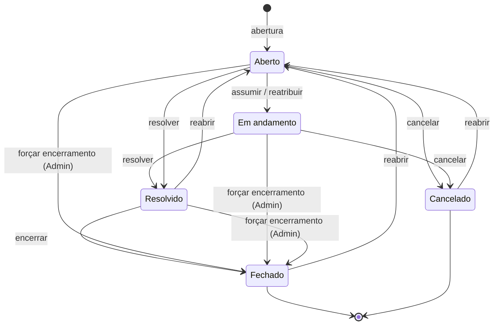

# Ciclo de Vida do Chamado

Todo chamado passa por um conjunto fixo de **status**. As regras abaixo são garantidas pelo
sistema — uma transição fora delas é recusada.

## Os status

| Status | Significa | Quem está com a bola |
|---|---|---|
| **Aberto** | Registrado, aguardando alguém assumir | Fila da equipe |
| **Em andamento** | Um atendente é responsável e está trabalhando | Atendente responsável |
| **Resolvido** | O atendente concluiu; falta confirmar o encerramento | Atendente (para encerrar) |
| **Fechado** | Encerrado definitivamente | — |
| **Cancelado** | Interrompido sem solução, com motivo registrado | — |

**Resolvido ≠ Fechado.** São etapas diferentes e contam separado nas métricas: *Resolvido* diz que
o trabalho foi feito; *Fechado* diz que o chamado foi confirmado e encerrado.

## Regras das transições

- **Assumir** coloca o atendente como responsável e move para *Em andamento*.
- **Reatribuir** (Admin) troca o responsável; se o chamado estava *Aberto*, ele passa a
  *Em andamento*.
- **Resolver** só é possível a partir de *Aberto* ou *Em andamento*; registra a data de conclusão.
- **Encerrar** (fechar) só é possível a partir de *Resolvido*.
- **Cancelar** só é possível enquanto o chamado não terminou (*Aberto* ou *Em andamento*) e
  **exige motivo**.
- **Forçar encerramento** (Admin) fecha direto de qualquer status não final, com motivo
  obrigatório. Ver [[Encerramento e Cancelamento]].
- **Reabrir** volta um chamado *Resolvido*, *Fechado* ou *Cancelado* para *Aberto*, **remove o
  responsável** e apaga a data de conclusão — ele volta para a fila.
- Chamados *Fechados* ou *Cancelados* não aceitam reatribuição nem mudança de prioridade.
- **Mudar a prioridade recalcula o prazo** ([[SLA]]) a partir do momento da mudança.

## Rastreabilidade

Cada transição gera uma entrada no **histórico** do chamado com quem fez, o quê e quando
(criação, assumir, reatribuir, resolver, fechar, cancelar, reabrir, mudança de prioridade,
comentário, encerramento forçado). O [[Relatório Mensal]] é calculado a partir desse histórico.
