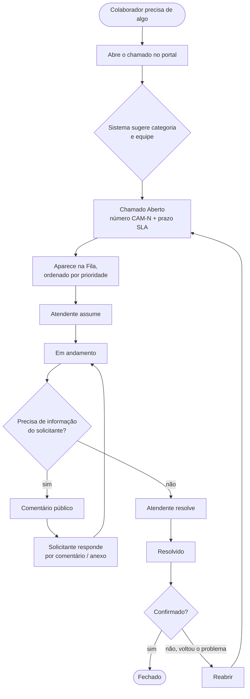

# Fluxo de Atendimento

Como uma solicitação percorre o portal, do pedido do colaborador ao encerramento.

## Passo a passo

1. **Abertura** — o colaborador descreve o problema, escolhe a categoria (ou aceita a sugestão
   automática) e a prioridade, e pode anexar arquivos. O chamado recebe um número `CAM-N` e um
   prazo. → [[Abertura de Chamados]]
2. **Fila** — o chamado entra na fila de *Abertos*, visível para os atendentes, ordenada por
   prioridade. → [[Fila, Kanban e Dashboard]]
3. **Assumir** — um atendente assume e vira o responsável. A equipe dele continua vendo o chamado,
   o que permite cobrir férias e ausências. → [[Grupos e Equipes]]
4. **Tratamento** — conversa com o solicitante por **comentários públicos**; alinhamentos da equipe
   por **comentários internos**, que o solicitante não vê. → [[Acompanhamento do Chamado]]
5. **Resolução** — o atendente marca como *Resolvido*.
6. **Encerramento** — o chamado é confirmado e *Fechado*. Se o problema voltar, é **reaberto** e
   retorna à fila.

## Durante todo o fluxo

- O **prazo (SLA)** fica visível em cada chamado, com cor de alerta ao se aproximar do vencimento.
  → [[SLA]]
- As telas se atualizam **em tempo real** — ninguém precisa recarregar a página para ver um
  chamado novo ou uma mudança de status.
- O Admin pode intervir a qualquer momento: **reatribuir**, **mudar a prioridade** ou **forçar o
  encerramento**. → [[Encerramento e Cancelamento]]
- Tudo fica registrado no **histórico** do chamado.

## Exceções

| Situação | O que fazer |
|---|---|
| Solicitante desistiu | Cancelar, motivo *Cancelado pelo solicitante* |
| Chamado aberto por engano | Cancelar, motivo *Aberto indevidamente* |
| Mesmo pedido já existe | Cancelar, motivo *Duplicata* |
| Solicitante não responde | Admin força o encerramento, motivo *Sem resposta* |
| Atendente responsável ausente | Colega da equipe atua no chamado, ou Admin reatribui |
