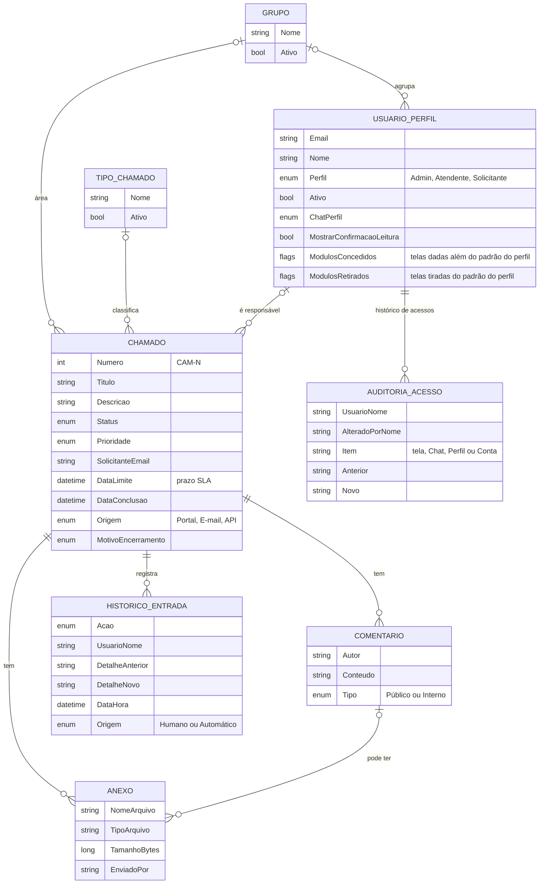
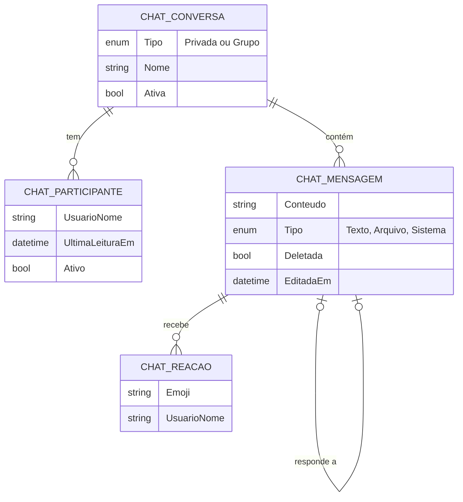

# Modelo de Dados

As principais informações que o sistema guarda e como se relacionam. Nomes em português, como no
código.

## Chamados

## Chat

Tabelas de apoio do chat: **ChatPresenca** (status Online/Ausente/Offline de cada usuário) e
**ChatHistorico** (auditoria de todas as ações do chat).

## Observações para o negócio
- **Nada de chamado é apagado** — o histórico e o relatório dependem disso.
  Ver [[ADR-005 Chamados nunca são apagados]].
- O **solicitante é identificado pelo e-mail**, o que prepara a futura
  [[Abertura por E-mail]].
- O **conteúdo original** de mensagens editadas ou excluídas do chat é preservado para auditoria.
- Senhas são guardadas apenas como **hash**, nunca em texto.
- O cadastro do usuário guarda só as **exceções** de telas em relação ao padrão do perfil; toda mudança
  de acesso vai para o **histórico de acessos**. Ver [[ADR-010 Acesso por módulo ajustável por pessoa]].
