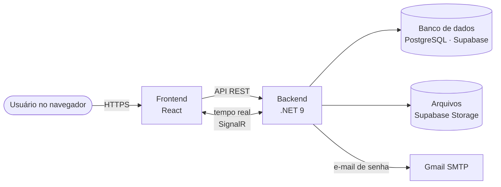

# Visão Técnica

Resumo para quem precisa conversar com a equipe técnica ou com fornecedores. O detalhe completo
está em `.specs/codebase/` (ARCHITECTURE, STACK, CONVENTIONS).

## Componentes

| Peça | Tecnologia | Papel |
|---|---|---|
| Frontend | React 19, TypeScript, Vite, Tailwind, shadcn/ui | Telas que o usuário vê |
| Backend (API) | .NET 9 (C#) | Regras de negócio, segurança, dados |
| Tempo real | SignalR | Atualiza telas e chat sem recarregar |
| Banco de dados | PostgreSQL no Supabase | Chamados, usuários, chat, histórico |
| Arquivos | Supabase Storage | Anexos de chamados e do chat |
| E-mail | Gmail (SMTP) | Envio do link de redefinição de senha |

## Organização do backend
O backend segue **Clean Architecture** em quatro camadas — cada uma só depende das de dentro:

| Camada | Contém |
|---|---|
| **Domain** | As regras de negócio puras (ex.: quais transições de status são válidas) |
| **Application** | Os casos de uso — cada ação do sistema é um comando ou consulta (padrão CQRS) |
| **Infrastructure** | Acesso ao banco, ao armazenamento de arquivos e ao e-mail |
| **WebApi** | A porta de entrada: endpoints HTTP e canal de tempo real |

Por isso as regras de negócio descritas neste vault valem **sempre**, independentemente da tela
usada — elas moram no núcleo do sistema, não no navegador.

## Qualidade e segurança
- **Testes automatizados:** mais de 300 testes de unidade no backend e testes de ponta a ponta
  (navegador) no frontend.
- **Autenticação por token** em todas as chamadas. O token só identifica a pessoa: o **perfil, a equipe e se a conta está ativa são lidos do cadastro a cada pedido** (com uma memória curta de 15 segundos, apagada na hora em que o cadastro muda), nunca do que o navegador
  informa.
- **Controle de concorrência:** duas edições simultâneas do mesmo chamado geram conflito em vez
  de uma apagar a outra.
- **Idempotência:** envios repetidos por clique duplo não duplicam registros.
- **Auditoria:** histórico de chamados e do chat.

## Método de desenvolvimento
O projeto usa **Spec-Driven Development (SDD)**: cada funcionalidade é especificada (spec →
design → tarefas) antes de ser codificada, revisada e só então integrada. As specs ficam em
`.specs/features/`. O fluxo de versões usa a branch `develop` para desenvolvimento e `main` para
produção, sempre por *pull request*.
